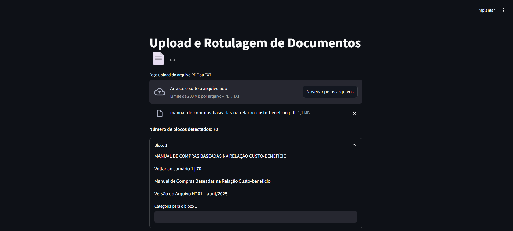
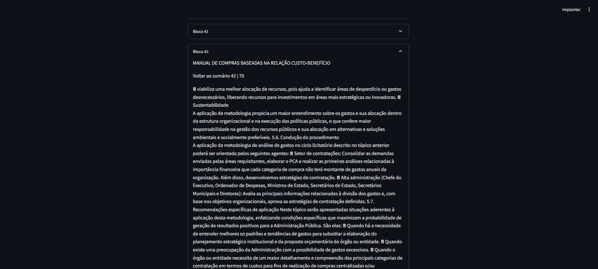
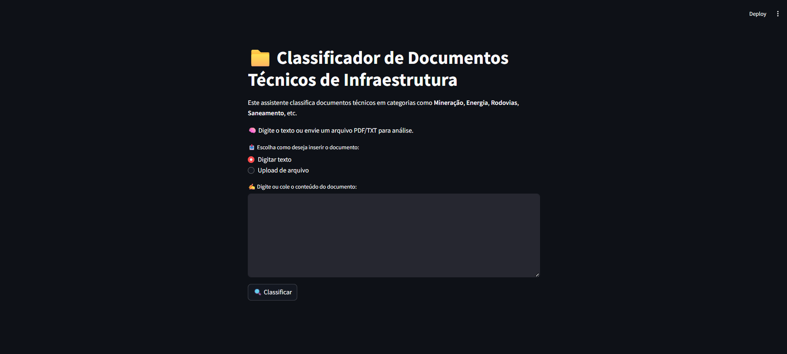

# 🚧 Infra Doc Classifier

Classificador de Documentos Técnicos de Infraestrutura utilizando **NLP com Transformers** 🚀

Este projeto tem como objetivo classificar automaticamente documentos técnicos de infraestrutura, segmentando-os por setores como energia, transporte, saneamento, entre outros. Ideal para organizações que lidam com grandes volumes de textos técnicos e desejam automação inteligente na triagem de conteúdos.

---

## 🧠 Tecnologias Utilizadas

- 🐍 Python 3.10+
- 🤗 Transformers (Hugging Face)
- 📊 Scikit-learn
- 🧮 Pandas & NumPy
- 📚 NLP e Tokenização
- 💻 Interface CLI para classificação

---

## 📁 Estrutura do Projeto

```
# ├── data/                  # Pasta para armazenar os dados
# │   ├── raw/               # Dados brutos
# │   └── processed/         # Dados limpos e preparados
# ├── notebooks/             # Análises e testes exploratórios (Jupyter Notebooks)
# ├── models/                # Modelos treinados salvos
# ├── src/                   # Código-fonte do projeto
# │   ├── __init__.py
# │   ├── data_preprocessing.py
# │   ├── train_model.py
# │   ├── evaluate_model.py
# │   └── inference.py
# ├── app/                   # Interface interativa (Streamlit)
# │   └── app.py
# ├── requirements.txt       # Dependências do projeto
# ├── README.md              # Descrição do projeto
# └── .gitignore
```

---
Exemplo de bloco
## 🖼️ Demonstrações Visuais

| Interface Upload                 | Exemplo de bloco                   | Interface de Classificação         
|----------------------------------|------------------------------------|------------------------------------|
|  |  |  |

---

## ✨ Funcionalidades

- 📥 Upload e leitura de documentos .txt
- 🧠 Classificação por setor com base no conteúdo
- 📈 Relatório de performance do modelo
- 💬 Feedback com métricas de acurácia, precisão, recall, F1

---

## ⚙️ Como Rodar Localmente

```bash
# Clone o repositório
git clone https://github.com/JaimeMartinsOliveira/infra-doc-classifier.git
cd infra-doc-classifier

# Crie um ambiente virtual
python -m venv venv
source venv/bin/activate  # Windows: venv\Scripts\activate

# Instale as dependências
pip install -r requirements.txt

# Execute o projeto
python init_project.py
```

---

## 🧪 Avaliação e Testes

Após o treinamento, você receberá métricas detalhadas como:

- ✅ Acurácia
- 🎯 Precisão
- 🔄 Recall
- 🧮 F1-score

---

## 🤝 Contribuições

Sinta-se à vontade para contribuir! Envie um Pull Request com melhorias, ou abra uma issue para discutir ideias. ✨

---

## 📄 Licença

Distribuído sob a licença MIT. Veja `LICENSE` para mais informações.

---

> Desenvolvido com 💙 por Jaime Martins Oliveira
